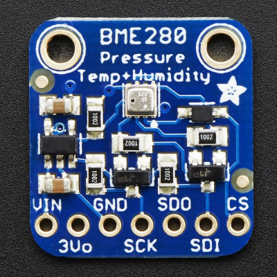

BME280
============

Python library to use BME280 on Beaglebone Black

| Board pin name | Board pin | Beaglebone Black pin name |
|----------------|-----------| --------------------------|
| VIN            | 1         | P9\_5, VDD\_5v            |
| 3Vo            | 2         | Not Used                  |
| GND            | 3         | P9\_1, Ground             |
| SCK            | 4         | P9\_19, I2C2\_CL          |
| SDO            | 5         | Not Used                  |
| SDI            | 6         | P9\_20, I2C_SDA           |
| CS             | 7         | Not Used                  |

SPI Logic pins:

All pins going into the breakout have level shifting circuitry to make them 3-5V logic level safe. Use whatever logic level is on Vin!

    SCK - This is the SPI Clock pin, its an input to the chip
    SDO - this is the Serial Data Out / Microcontroller In Sensor Out pin, for data sent from the BMP183 to your processor
    SDI - this is the Serial Data In / Microcontroller Out Sensor In pin, for data sent from your processor to the BME280
    CS - this is the Chip Select pin, drop it low to start an SPI transaction. Its an input to the chip

If you want to connect multiple BME280's to one microcontroller, have them share the SDI, SDO and SCK pins. Then assign each one a unique CS pin.
I2C Logic pins:

    SCK - this is also the I2C clock pin, connect to your microcontrollers I2C clock line.
    SDI - this is also the I2C data pin, connect to your microcontrollers I2C data line.
